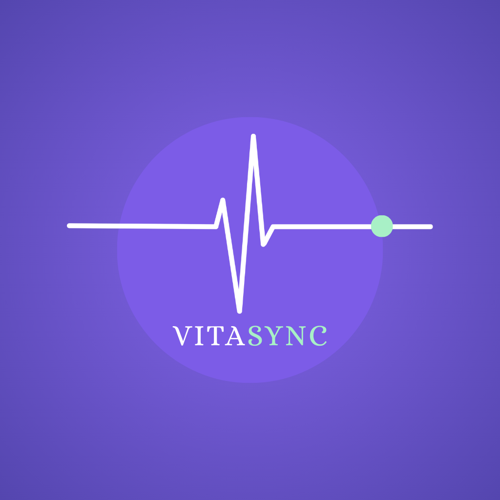
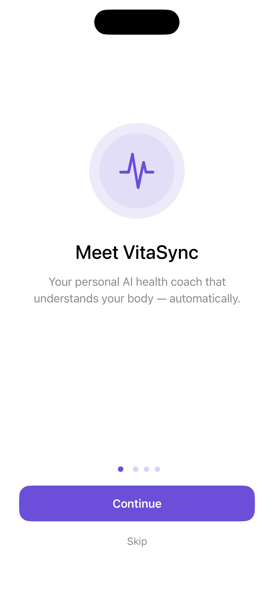
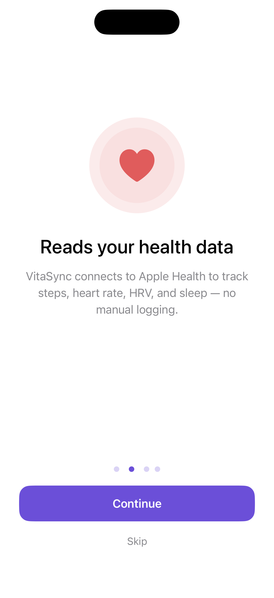
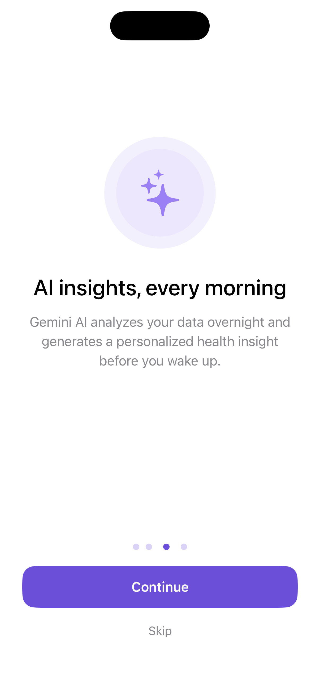
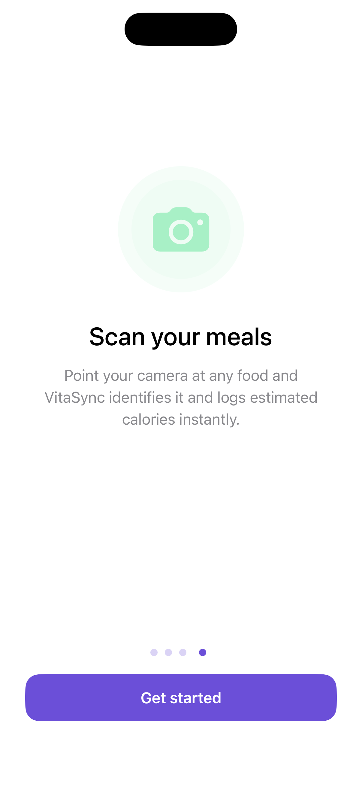
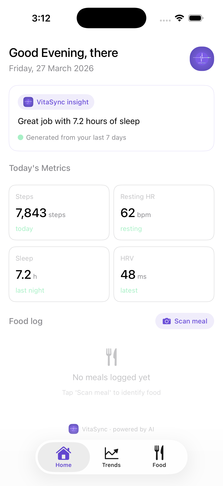
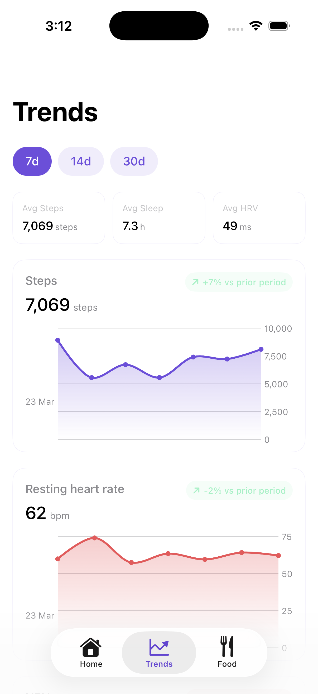
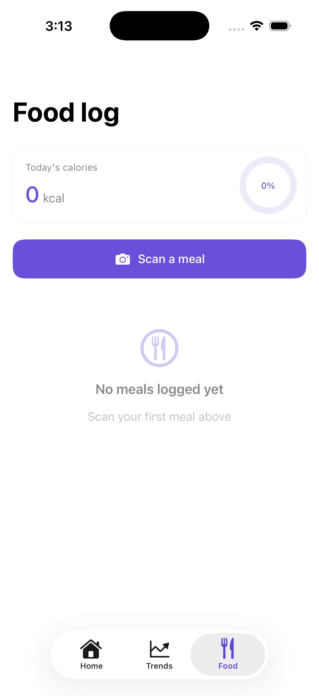
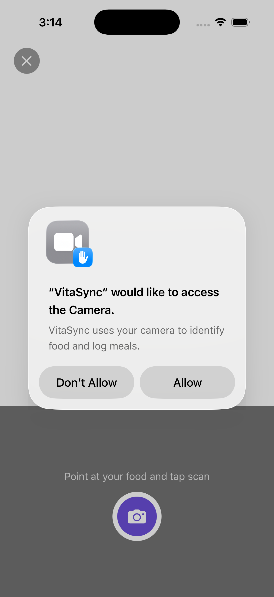
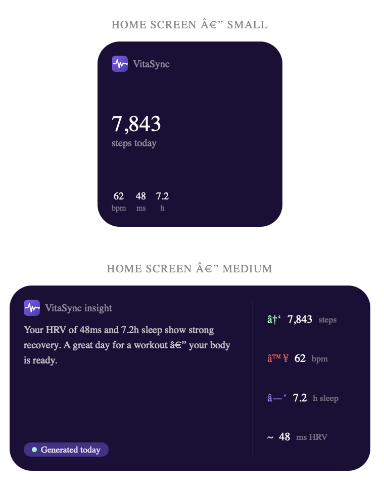

<div align="center">



# VitaSync
### AI-Powered iOS Health Coach

[](https://swift.org)
[](https://developer.apple.com)
[](https://developer.apple.com/swiftui)
[](https://ai.google.dev)
[](https://developer.apple.com/healthkit)
[](LICENSE)

**VitaSync passively reads your biometrics, generates a personalized AI health insight every morning, and surfaces it on your lock screen — zero manual input required.**

[Features](#features) • [Screenshots](#screenshots) • [Architecture](#architecture) • [Tech Stack](#tech-stack) • [Setup](#setup) • [Author](#author)

</div>

---

## Screenshots

<div align="center">
<table>
  <tr>
    <td align="center">
      
      <br/><sub>Onboarding View1</sub>
    </td>
    <td align="center">
      
      <br/><sub>Onboarding View2</sub>
    </td>
    <td align="center">
      
      <br/><sub>Onboarding View3</sub>
    </td>
    <td align="center">
      
      <br/><sub>Onboarding View4</sub>
    </td>
    <td align="center">
      
      <br/><sub>Home — AI Insight</sub>
    </td>
    <td align="center">
      
      <br/><sub>Trends — Swift Charts</sub>
    </td>
    <td align="center">
      
      <br/><sub>Food Log</sub>
    </td>
    <td align="center">
      
      <br/><sub>Food Scanner</sub>
    </td>
    <td align="center">
      
      <br/><sub>App Widget</sub>
    </td>
  </tr>
</table>
</div>

---

## Features

### 🤖 AI-Powered Daily Insights
VitaSync sends your real biometric data to Google Gemini 2.5 Flash every night and generates a warm, specific, actionable health insight — referenced to your actual numbers. No generic advice.

### 💓 Passive HealthKit Integration  
Reads steps, resting heart rate, HRV, and sleep automatically from Apple Health. No manual logging. Uses `async let` concurrent fetching for sub-second data loading across all 4 metrics simultaneously.

### 📸 Vision Food Scanner
Point the camera at any meal — VitaSync uses `VNClassifyImageRequest` to identify the food and estimate calories. Covers 40+ foods including Indian cuisine. Confidence score surfaced with reliability warning.

### 🌙 Nightly Background Refresh
`BGProcessingTask` wakes the app at 2am, fetches fresh health data, calls Gemini AI, and saves the new insight — all before you wake up. The morning insight loads instantly with no spinner.

### 📊 Swift Charts Trend Visualisation
7, 14, and 30-day animated trend charts for all 4 health metrics using `AreaMark`, `LineMark`, and `PointMark`. Trend badge shows percentage change vs prior period.

### 🔒 Lock Screen Widget
Four WidgetKit widget sizes including lock screen `accessoryRectangular` and `accessoryCircular`. Data bridges from app to widget via App Groups shared `UserDefaults` container.

### 🎙️ Siri Integration
`AppIntent` allows users to ask "Hey Siri, get my health status with VitaSync." Returns a spoken summary plus a custom SwiftUI `HealthSnippetView` with live metrics.

---

## Architecture

VitaSync follows **MVVM** with a clean service layer:
```
┌─────────────────────────────────────────┐
│              Presentation               │
│   SwiftUI Views  ←→  @Observable VMs   │
└────────────────┬────────────────────────┘
                 │
┌────────────────▼────────────────────────┐
│               Services                  │
│  HealthKitService  │  GeminiService     │
│  FoodClassifier    │  BackgroundTask    │
└────────────────┬────────────────────────┘
                 │
┌────────────────▼────────────────────────┐
│             Persistence                 │
│  SwiftData (HealthLog, FoodEntry)       │
│  App Groups UserDefaults (Widget)       │
└─────────────────────────────────────────┘
```

### Data Flow
```
HealthKit ──► HealthKitService ──► HomeViewModel
                                        │
                                        ▼
                               GeminiService (REST)
                                        │
                                        ▼
                               SwiftData + App Groups
                                        │
                              ┌─────────┴──────────┐
                              ▼                    ▼
                          HomeView            WidgetKit
                       (instant load)     (lock screen)
```

---

## Tech Stack

| Framework | Usage |
|-----------|-------|
| **SwiftUI** | All UI — views, navigation, animations |
| **SwiftData** | Local persistence — HealthLog, FoodEntry |
| **HealthKit** | Steps, resting HR, HRV, sleep analysis |
| **Vision** | `VNClassifyImageRequest` food classification |
| **AVFoundation** | Camera capture session |
| **BackgroundTasks** | Nightly 2am BGProcessingTask |
| **WidgetKit** | 4 widget families including lock screen |
| **Swift Charts** | Animated area + line trend charts |
| **App Intents** | Siri voice query integration |
| **Gemini API** | LLM insight generation (2.5 Flash) |
| **App Groups** | App ↔ Widget data bridging |

---

## Project Structure
```
VitaSync/
├── Models/
│   ├── HealthLog.swift          # @Model — biometric log with AI insight
│   ├── FoodEntry.swift          # @Model — food scan result
│   └── HealthDataPoint.swift    # Chart data model
├── Resources/
│   ├── VitaSyncColors.swift     # Brand color system
│   ├── WidgetDataStore.swift    # App Groups bridge (shared target)
│   └── Secrets.swift            # API key loader (Secrets.plist gitignored)
├── Services/
│   ├── HealthKitService.swift   # HKHealthStore queries
│   ├── GeminiService.swift      # REST client + prompt engineering
│   ├── BackgroundTaskManager.swift
│   ├── FoodClassifierService.swift
│   └── VitaSyncIntent.swift     # Siri AppIntent
├── Views/
│   ├── Home/                    # Dashboard + insight card
│   ├── Trends/                  # Swift Charts screens
│   ├── Food/                    # Scanner + food log
│   └── Onboarding/             # 4-page onboarding flow
└── VitaSyncWidget/              # Widget extension target
    ├── VitaSyncWidget.swift     # Timeline provider
    └── VitaSyncWidgetViews.swift
```

---

## Setup

### Prerequisites
- Xcode 16+
- iOS 17+ device or Simulator
- Google AI Studio account (free)
- Apple Developer account (free personal team works)

### Installation
```bash
# 1. Clone the repo
git clone https://github.com/manishj9/VitaSync.git
cd VitaSync

# 2. Create your Secrets.plist
cp Secrets.plist.template Secrets.plist
# Add your Gemini API key inside Secrets.plist

# 3. Open in Xcode
open VitaSync.xcodeproj
```

### Getting a Gemini API Key

1. Go to [aistudio.google.com](https://aistudio.google.com)
2. Click **Get API Key** → **Create API Key**
3. Select or create a project with billing enabled (free tier)
4. Copy the key into `Secrets.plist` under `GEMINI_API_KEY`

### Secrets.plist format
```xml
<?xml version="1.0" encoding="UTF-8"?>
<!DOCTYPE plist PUBLIC "-//Apple//DTD PLIST 1.0//EN"
  "http://www.apple.com/DTDs/PropertyList-1.0.dtd">
<plist version="1.0">
<dict>
    <key>GEMINI_API_KEY</key>
    <string>YOUR_KEY_HERE</string>
</dict>
</plist>
```

> ⚠️ `Secrets.plist` is in `.gitignore` and will never be committed.

---

## Key Implementation Details

### Concurrent HealthKit fetching
```swift
async let steps      = healthKit.fetchTodaySteps()
async let restingHR  = healthKit.fetchRestingHeartRate()
async let hrv        = healthKit.fetchHRV()
async let sleepHours = healthKit.fetchLastNightSleep()

// All 4 run in parallel — not sequentially
steps = await steps
```

### Gemini prompt engineering
```swift
"""
You are VitaSync, a warm personal health coach AI.
- Steps today: \(steps)
- Resting HR: \(Int(restingHR)) bpm  
- HRV: \(Int(hrv)) ms
- Sleep: \(String(format: "%.1f", sleepHours)) hours

Write exactly 2 complete sentences. Reference at least 
one actual number. End with one actionable suggestion.
"""
```

### App Groups widget bridge
```swift
// Main app writes
UserDefaults(suiteName: "group.com.manishjawale.VitaSync")?
    .set(encoded, forKey: "vitasync.widget.healthdata")
WidgetCenter.shared.reloadAllTimelines()

// Widget reads
UserDefaults(suiteName: "group.com.manishjawale.VitaSync")?
    .data(forKey: "vitasync.widget.healthdata")
```

---

## Roadmap

- [ ] Apple Watch companion app
- [ ] Streak tracking and goal setting
- [ ] Nutrition breakdown from food scans
- [ ] CloudKit cross-device sync
- [ ] App Store submission

---

## Author

**Manish Jawale**  
iOS App Developer

[](https://github.com/manishj9)

---

## License

MIT License — see [LICENSE](LICENSE) for details.

---

<div align="center">
Built with ❤️ using Swift, SwiftUI, and way too much HealthKit documentation.
</div>
